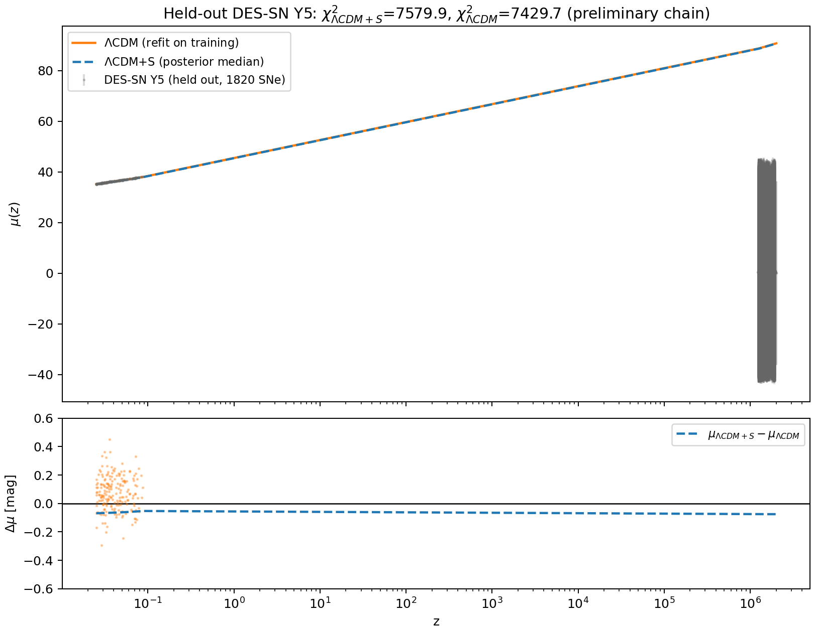

[](LICENSE)
[](https://www.python.org/downloads/)
[](tests/)
<!-- Zenodo DOI badge: mint a DOI by archiving a release at zenodo.org, then
     replace this comment with the badge Zenodo gives you. Do not use a
     placeholder DOI. -->

# ΛCDM+S: Horizon Thermodynamics in Cosmological MCMC

This repository contains the Bayesian MCMC pipeline and numerical background
solvers for **ΛCDM+S**, a thermodynamically motivated extension of standard
cosmology in which the late-time accelerated expansion is modelled as the
universe evolving toward a maximum-entropy de Sitter state of the Hubble
horizon. The entropy sector enters through a logistic transition
χ(t) = 1/(1+e^{−k(t−t_crit)}) with two extra parameters (k, t_crit) beyond
(H₀, Ω_{Λ+S}).



## Integrity statement (read this first)

This pipeline was **corrected in September 2026** after an audit found that
the previously published results came from code in which the entropy sector
was frozen (`lcdm_limit=True`), making the k and t_crit "posteriors" exact
copies of their priors, and in which the compressed-CMB likelihood used the
drag-epoch sound horizon at the wrong epoch. **Numbers in older reports,
posters, and papers derived from that code are superseded by the artifacts
in `output/`, which are regenerated from the corrected pipeline.** Key
changes, all verifiable in the git history:

1. The sampled (k, t_crit) now genuinely propagate to H(z) and all
   observables; a hard guard aborts any run where they do not.
2. ℓ_A uses the parameter-dependent r_s(z\*) (Hu–Sugiyama z\*, sound-horizon
   integral); BAO r_d uses the EH98 drag epoch. A regression gate requires
   the reference Planck ΛCDM to match the compressed means (0.03% / 0.16%
   on R / ℓ_A) before any inference.
3. DES-SN Y5 is genuinely held out: it is carried as
   `joint.holdout_likelihoods`, never in the training joint (hard
   assertion).
4. The prior-predictive metric is horizon **area**, matching the printed
   formula: mean fRMSE **33.1% ± 0.25% (SEM)**, best realization **82.6%**
   similarity over 500 prior draws. (Older "14.9% / 93.4%" figures were
   computed on horizon radius and must not be quoted against the area
   metric.)
5. Prior provenance is disclosed in code: the Planck algebraic anchoring
   yields H₀ ≈ 67.8, which does **not** reproduce the declared prior centre
   of 73.0. The declared priors are a methodological choice, recorded as
   such (`derivation_reproduces_declared=False`).
6. DES-SN Y5 counts, verified from the data file: **1820 unique SNe
   (1623 DES + 197 external low-z anchors)** — not 1635, and not repeat
   measurements.

## Model

Sampled parameters θ = (H₀, Ω_{Λ+S}, k, t_crit) with declared Gaussian
priors:

| Parameter | Prior | Origin |
| :--- | :---: | :--- |
| H₀ | 73.000 ± 2.000 km/s/Mpc | declared (see integrity note 5) |
| Ω_{Λ+S} | 0.688 ± 0.012 | declared, flatness-consistent |
| k | 0.372 ± 0.070 Gyr⁻¹ | logistic ODE timescale k = 1/τ |
| t_crit | 15.827 ± 1.500 Gyr | branch-residual crossover epoch |

Background: E² = Ω_r a⁻⁴ + Ω_m a⁻³ + Ω_{Λ+S}·χ(t)/χ₀, integrated by RK4 in
ln a with the entropy sector live.

## Key results (preliminary chain — see label in the JSON artifacts)

The shipped chain is **preliminary-sized** (48 walkers × 250 steps × 2
independent runs on the real data). The full written-report size
(48 × 50,000 × 3) runs with the same one command below and overwrites these
artifacts. All values in `output/tables/*.json` are generated by the
scripts, never hand-entered.

<!--KEY_RESULTS_TABLE-->

Training joint: Pantheon+ (1465 SNe after calibrator cuts) + DESI DR2 +
BOSS DR12 + SH0ES + Planck compressed CMB. Held out: DES-SN Y5 (1820 SNe).
Training AIC/BIC and held-out DES statistics are reported **separately**
and are never subtracted across datasets.

## 🚀 Quickstart & Reproducibility

```bash
# 1. Clone repository & set up environment
git clone https://github.com/liamdesre0-byte/EUCYS---Lambda-CDM-S.git
cd EUCYS---Lambda-CDM-S
conda env create -f environment.yml
conda activate lcdm-plus-s

# 2. Run numerical tests (incl. CMB regression + entropy-sector guard)
pytest tests/

# 3. Reproduce everything, in causal order (no arrow points backwards):
python scripts/01_run_prior_checks.py                  # priors + prior-predictive (no data)
python scripts/02_run_mcmc.py --walkers 48 --steps 250 --burn 75 --runs 2   # preliminary
# python scripts/02_run_mcmc.py --walkers 48 --steps 50000 --burn 2000 --runs 3  # full production
python scripts/03_ppc_des_sn5.py                       # held-out DES comparison
python scripts/04_plot_corner.py                       # corner plot + LaTeX tables from the chain
```

The sampler is the package's **affine-invariant ensemble** (Goodman–Weare
stretch move) with Metropolis–Hastings and differential-evolution variants
and an optional [Cobaya](https://cobaya.readthedocs.io) wrapper
(`CobayaRunner`); the shipped results use the built-in affine sampler.
R̂ is computed **across independent runs** with independent seeds.

## Repository layout

```
data/               Pantheon+ / DES-SN Y5 / SH0ES vectors (public survey data)
src/lcdm_plus_s/    core package: background solver, likelihoods, samplers
scripts/01..04      causal reproduction chain (priors → MCMC → holdout → plots)
configs/            run configurations (default = production, diagnostic = smoke)
tests/              pytest suite (solver limits, likelihoods, config guards)
notebooks/          interactive demos (horizon area, H0 sensitivity)
output/figures      generated plots        (regenerated by scripts)
output/tables       generated JSON/LaTeX   (regenerated by scripts)
output/chains       MCMC chains + prior ensembles (preliminary chain shipped;
                    archive full production chains on Zenodo/OSF, not in git)
paper/              LaTeX sources of the written report
original/           unmodified pre-audit research scripts (provenance)
```

## 📜 Citation

```bibtex
@software{lcdm_s_horizon_2026,
  author    = {Desre, Liam},
  title     = {ΛCDM+S: Bayesian Cosmological Pipeline for Horizon Entropy Models},
  year      = {2026},
  url       = {https://github.com/liamdesre0-byte/EUCYS---Lambda-CDM-S}
}
```

See `CITATION.cff` for machine-readable metadata. Data credits: Pantheon+
(Brout et al. 2022; Scolnic et al. 2022), DES-SN5YR (DES Collaboration
2024), DESI DR2 BAO, BOSS DR12, SH0ES (Riess et al. 2022), Planck 2018
compressed distance priors.
